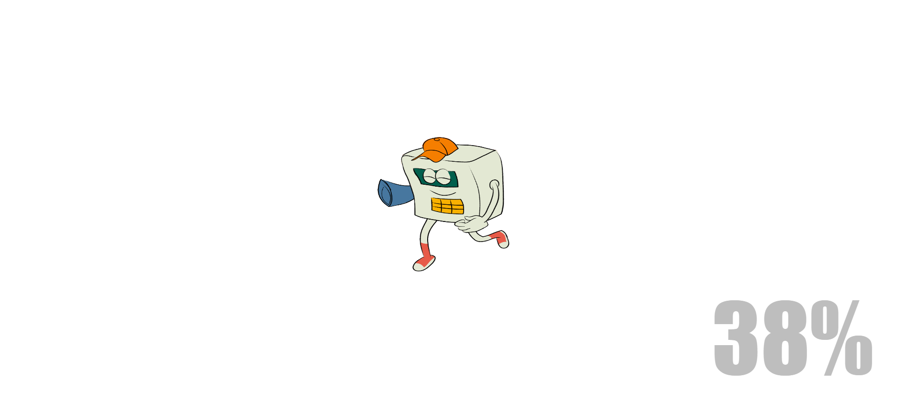

# Meter Box App

---

# About Khanyisa

Khanyisa is a meter box application designed to simplify the process of purchasing electricity tokens for users. The app allows users to manage their electricity purchases efficiently while providing features such as a map for locating the nearest City of Tshwane department and live chat support for assistance.

### Built With

## How To Install

To get started, clone the repo:

Once opened, check the structure of the folders.

# Project Structure

## meter_box_app...

- `htdocs/`
  - `uploads/`
    - `consultant_images/`
  - `assets/`
  - `css/`
  - `js/`
  - `includes/`
  - `connection.php`
  - `home.php`
  - `tokens.php`
  - `successful.php`
  - `office.php`
  - `office_detail.php`
  - `chat.php`
  - `logout.php`
  - `README.md`
  - `splash.html`

## PAGES AND FUNCTIONALITY

| Page               | Description                                                                                                                                 |
| ------------------ | ------------------------------------------------------------------------------------------------------------------------------------------- |
| Home Page          | - The landing page of the application where users can navigate to purchase tokens and view other functionalities.                           |
| Tokens Page        | - Users can enter their meter box number, select a bank, and specify the amount to purchase electricity tokens.                             |
| Successful Page    | - Displays the purchased tokens and a confirmation message after a successful transaction.                                                  |
| Office Page        | - Lists department locations with interactive maps and consultant details, allowing users to get walking distances and contact information. |
| Office Detail      | - Provides detailed information about a specific office, including a map view and a list of available consultants.                          |
| Chat Functionality | - A chat feature available on every page for users to get assistance, which can be opened and closed as needed.                             |

## Website Concept

The concept behind Khanyisa is to create an easy-to-use platform for purchasing electricity tokens while providing users with access to necessary support and information through an intuitive interface and interactive features.

## UI Design

### Splash Screen (PreLoader)

### Login

### Homepage

### Office Page

## Development Process

### Important Notice

- Special thanks to the various online resources and tutorials that have guided me throughout this project.

### Succession Processes

- The intended functionalities of the app are fully operational, allowing users to navigate the app seamlessly.

### C.R.U.D Functionality

- Create - Users can create token purchases and manage their accounts.
- Read - Users can view their transaction history and office details.
- Update - Users can update their profile and settings.
- Delete - Users can delete their accounts or transactions if necessary.

## Challenges

- Adapting to the use of a new database management system (MySQL) was initially challenging.
- Handling various PHP errors was a learning curve, leading to improvements in my coding skills.

## Future Solutions

- Continue improving the database interactions for better performance.
- Enhance the user interface with more interactive elements.
- Expand the app's functionalities, including more detailed reports and features for user engagement.

## Mockups

### Profile Mockup

### Community Page Mockup

### Individual Post Page Mockup

### Home Page Mockup

## Demonstration

[Link To Demonstration Video](https://drive.google.com/drive/folders/your_demo_link)

### License

[MIT](LICENSE) © Zechaniah Hlongwane
